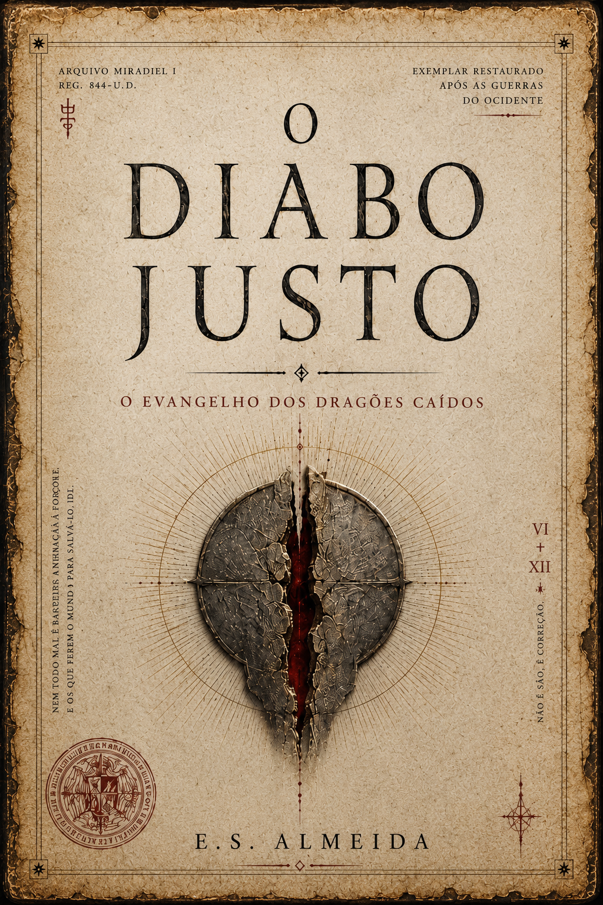

# Código completo — Ergo Valle One Page v1

## index.html
```html
<!doctype html>
<html lang="pt-BR">
<head>
  <meta charset="UTF-8" />
  <meta name="viewport" content="width=device-width, initial-scale=1.0" />
  <title>Ergo Valle Editora — Literatura Autoral</title>
  <meta name="description" content="Ergo Valle Editora. Literatura autoral, fantasia sombria e obras de E. S. Almeida. O Diabo Justo disponível em eBook Kindle." />
  <link rel="preconnect" href="https://fonts.googleapis.com">
  <link rel="preconnect" href="https://fonts.gstatic.com" crossorigin>
  <link href="https://fonts.googleapis.com/css2?family=Cormorant+Garamond:wght@500;600;700&family=Inter:wght@400;500;600;700;800&display=swap" rel="stylesheet">
  <link rel="stylesheet" href="style.css" />
</head>
<body>
  <div class="ambient" aria-hidden="true"></div>

  <header class="site-header">
    <a class="brand" href="#top" aria-label="Ergo Valle Editora">
      <span class="brand-mark">EV</span>
      <span>
        <strong>Ergo Valle</strong>
        <small>Editora Independente</small>
      </span>
    </a>

    <nav class="nav" aria-label="Navegação principal">
      <a href="#livros">Livros</a>
      <a href="#editora">Editora</a>
      <a href="#autor">Autor</a>
      <a href="#contato">Contato</a>
    </nav>
  </header>

  <main id="top">
    <section class="hero section-pad">
      <div class="hero-copy">
        <p class="eyebrow">Selo editorial de E. S. Almeida</p>
        <h1>Literatura autoral, fantasia sombria e livros para atravessar o silêncio.</h1>
        <p class="lead">A Ergo Valle Editora nasce como uma casa independente para obras de imaginação, conflito espiritual, mito, dor, beleza e transcendência.</p>

        <div class="hero-actions">
          <a class="btn primary" href="https://www.amazon.com.br/Diabo-Justo-Evangelho-Drag%C3%B5es-Ca%C3%ADdos-ebook/dp/B0H3CWHC7X" target="_blank" rel="noopener">Comprar eBook Kindle</a>
          <a class="btn ghost" href="#livros">Conhecer o catálogo</a>
        </div>

        <div class="status-row">
          <span>eBook disponível</span>
          <span>Versão física em breve</span>
          <span>Fantasia sombria</span>
        </div>
      </div>

      <div class="hero-book" aria-label="Livro em destaque: O Diabo Justo">
        <div class="book-glow"></div>
        
      </div>
    </section>

    <section class="featured section-pad" id="livros">
      <div class="section-title">
        <p class="eyebrow">Livro em destaque</p>
        <h2>O Diabo Justo</h2>
        <p>Livro Primeiro — <em>O Evangelho dos Dragões Caídos</em></p>
      </div>

      <div class="featured-grid">
        <article class="book-panel main-book">
          <div class="panel-cover">
            
          </div>
          <div class="panel-content">
            <span class="tag available">Disponível agora</span>
            <h3>eBook Kindle</h3>
            <p>A edição digital de <strong>O Diabo Justo</strong>, de E. S. Almeida, já está disponível para leitura no Kindle.</p>
            <a class="btn primary small" href="https://www.amazon.com.br/Diabo-Justo-Evangelho-Drag%C3%B5es-Ca%C3%ADdos-ebook/dp/B0H3CWHC7X" target="_blank" rel="noopener">Comprar na Amazon</a>
          </div>
        </article>

        <article class="book-panel soon-book">
          <div class="panel-cover muted-cover">
            
          </div>
          <div class="panel-content">
            <span class="tag soon">Em breve</span>
            <h3>Versão física</h3>
            <p>A edição impressa ainda não está disponível. A versão física será anunciada em breve pela Ergo Valle Editora.</p>
            <button class="btn disabled small" type="button">Versão física em breve</button>
          </div>
        </article>
      </div>
    </section>

    <section class="catalog section-pad">
      <div class="section-title left">
        <p class="eyebrow">Catálogo Ergo Valle</p>
        <h2>Obras e projetos editoriais</h2>
      </div>

      <div class="catalog-grid">
        <article class="catalog-card">
          
          <div>
            <span class="tag available">eBook disponível</span>
            <h3>O Diabo Justo</h3>
            <p>E. S. Almeida</p>
            <a href="https://www.amazon.com.br/Diabo-Justo-Evangelho-Drag%C3%B5es-Ca%C3%ADdos-ebook/dp/B0H3CWHC7X" target="_blank" rel="noopener">Ver edição Kindle</a>
          </div>
        </article>

        <article class="catalog-card placeholder-card">
          <div class="placeholder-cover">EV</div>
          <div>
            <span class="tag soon">em preparação</span>
            <h3>Próximas publicações</h3>
            <p>Novos títulos autorais da Ergo Valle.</p>
            <a href="#contato">Acompanhar novidades</a>
          </div>
        </article>
      </div>
    </section>

    <section class="about section-pad" id="editora">
      <div class="text-card">
        <p class="eyebrow">Sobre a editora</p>
        <h2>Uma casa para narrativas intensas.</h2>
        <p>A Ergo Valle é uma editora independente criada para publicar obras de fantasia sombria, literatura filosófica, ficção espiritual e narrativas autorais que unem mito, linguagem poética e conflito humano.</p>
        <p>O selo nasce do desejo de transformar livros em experiências: texto, imagem, som, presença digital e memória. Cada obra publicada pela Ergo Valle deve carregar uma identidade própria — elegante, profunda e reconhecível.</p>
      </div>

      <div class="values-grid">
        <div><strong>Fantasia sombria</strong><span>Mitos, deuses, queda, redenção e mundos em ruína.</span></div>
        <div><strong>Literatura autoral</strong><span>Obras independentes com voz própria e acabamento editorial.</span></div>
        <div><strong>Experiência transmídia</strong><span>Livro, áudio, imagem, páginas digitais e futuras edições físicas.</span></div>
      </div>
    </section>

    <section class="author section-pad" id="autor">
      <div class="author-box">
        <div class="author-avatar">ES</div>
        <div>
          <p class="eyebrow">Autor e fundador</p>
          <h2>E. S. Almeida</h2>
          <p>E. S. Almeida é escritor independente, criador do projeto Livro Sonoro e fundador da Ergo Valle Editora. Sua escrita atravessa fantasia sombria, espiritualidade, mitologia, dor, silêncio e transformação.</p>
          <p>Além da escrita literária, desenvolve projetos editoriais, audiolivros, páginas digitais e experiências de leitura que aproximam a palavra escrita da palavra falada.</p>
        </div>
      </div>
    </section>

    <section class="contact section-pad" id="contato">
      <div class="contact-card">
        <p class="eyebrow">Contato</p>
        <h2>Fale com a Ergo Valle</h2>
        <p>Para acompanhar lançamentos, parcerias, leitura crítica, direitos, imprensa ou futuras edições físicas.</p>

        <div class="contact-links">
          <a href="mailto:ergovalle.editora@gmail.com">ergovalle.editora@gmail.com</a>
          <a href="https://www.instagram.com/ergovalle" target="_blank" rel="noopener">Instagram @ergovalle</a>
          <a href="https://youtube.com/@livrosonoropodcast" target="_blank" rel="noopener">Projeto Livro Sonoro</a>
        </div>
      </div>
    </section>
  </main>

  <footer class="footer">
    <p>© Ergo Valle Editora · Literatura autoral independente</p>
  </footer>

  <script src="script.js"></script>
</body>
</html>

```

## style.css
```css
:root {
  --bg: #050403;
  --bg2: #0d0907;
  --paper: #efe3cd;
  --text: #f5ead6;
  --muted: #b5a68e;
  --line: rgba(221, 184, 117, .18);
  --gold: #d6ae68;
  --gold2: #8f6735;
  --wine: #411414;
  --green: #48634d;
  --card: rgba(255, 245, 224, .055);
  --shadow: 0 30px 90px rgba(0,0,0,.42);
}

* { box-sizing: border-box; }
html { scroll-behavior: smooth; }
body {
  margin: 0;
  min-height: 100vh;
  background:
    radial-gradient(circle at 18% 0%, rgba(88, 57, 23, .36), transparent 34rem),
    radial-gradient(circle at 88% 18%, rgba(74, 18, 18, .28), transparent 34rem),
    linear-gradient(180deg, #030201 0%, #080504 48%, #050403 100%);
  color: var(--text);
  font-family: Inter, system-ui, sans-serif;
}

.ambient {
  position: fixed;
  inset: 0;
  pointer-events: none;
  opacity: .065;
  background-image:
    linear-gradient(rgba(255,255,255,.06) 1px, transparent 1px),
    linear-gradient(90deg, rgba(255,255,255,.06) 1px, transparent 1px);
  background-size: 52px 52px;
  mask-image: linear-gradient(to bottom, #000, transparent 80%);
}

a { color: inherit; text-decoration: none; }
img { max-width: 100%; display: block; }
button { font: inherit; }

.site-header {
  width: min(1180px, calc(100% - 36px));
  margin: 0 auto;
  padding: 24px 0;
  display: flex;
  justify-content: space-between;
  align-items: center;
  gap: 20px;
  position: sticky;
  top: 0;
  z-index: 20;
  backdrop-filter: blur(16px);
}

.brand { display: flex; align-items: center; gap: 12px; }
.brand-mark {
  width: 48px;
  height: 48px;
  border: 1px solid var(--line);
  border-radius: 50%;
  display: grid;
  place-items: center;
  color: var(--gold);
  font-family: "Cormorant Garamond", serif;
  font-weight: 700;
  font-size: 1.25rem;
  background: rgba(0,0,0,.22);
}
.brand strong { display: block; font-family: "Cormorant Garamond", serif; color: var(--gold); font-size: 1.45rem; line-height: 1; }
.brand small { color: var(--muted); font-size: .78rem; text-transform: uppercase; letter-spacing: .15em; }

.nav { display: flex; gap: 18px; color: var(--muted); font-size: .95rem; }
.nav a:hover { color: var(--gold); }

.section-pad { width: min(1180px, calc(100% - 36px)); margin: 0 auto; padding: 74px 0; }
.hero {
  min-height: calc(100vh - 96px);
  display: grid;
  grid-template-columns: 1.08fr .72fr;
  gap: 54px;
  align-items: center;
}

.eyebrow { margin: 0 0 12px; color: var(--gold); text-transform: uppercase; letter-spacing: .22em; font-size: .74rem; font-weight: 800; }
h1, h2, h3 { font-family: "Cormorant Garamond", Georgia, serif; }
h1 { margin: 0; max-width: 760px; font-size: clamp(3.1rem, 7vw, 6.4rem); line-height: .88; letter-spacing: -.035em; }
.lead { max-width: 660px; margin: 24px 0 0; color: var(--muted); font-size: 1.14rem; line-height: 1.75; }
.hero-actions { display: flex; flex-wrap: wrap; gap: 14px; margin-top: 30px; }
.btn {
  display: inline-flex;
  align-items: center;
  justify-content: center;
  border-radius: 999px;
  min-height: 48px;
  padding: 0 24px;
  border: 1px solid var(--line);
  font-weight: 800;
  transition: .22s ease;
}
.btn:hover { transform: translateY(-2px); }
.btn.primary { background: linear-gradient(135deg, var(--gold), #9d6d31); color: #170d05; border-color: transparent; }
.btn.ghost { background: rgba(255,255,255,.04); color: var(--text); }
.btn.small { min-height: 42px; padding: 0 18px; font-size: .9rem; }
.btn.disabled { background: rgba(255,255,255,.045); color: var(--muted); cursor: not-allowed; }

.status-row { display: flex; gap: 10px; flex-wrap: wrap; margin-top: 22px; }
.status-row span, .tag {
  display: inline-flex;
  align-items: center;
  border: 1px solid var(--line);
  border-radius: 999px;
  padding: 7px 11px;
  color: var(--muted);
  background: rgba(255,255,255,.035);
  font-size: .78rem;
  font-weight: 800;
  text-transform: uppercase;
  letter-spacing: .08em;
}
.tag.available { color: #dbe4bd; border-color: rgba(124, 160, 96, .3); }
.tag.soon { color: #e3c99a; border-color: rgba(214,174,104,.28); }

.hero-book { position: relative; display: flex; justify-content: center; }
.book-glow { position: absolute; inset: 14% 5%; background: radial-gradient(circle, rgba(214,174,104,.3), transparent 62%); filter: blur(26px); }
.hero-book img {
  width: min(380px, 92%);
  border-radius: 10px;
  box-shadow: 0 40px 100px rgba(0,0,0,.58);
  transform: rotate(-2deg);
  border: 1px solid rgba(214,174,104,.25);
  position: relative;
}

.section-title { text-align: center; margin-bottom: 36px; }
.section-title.left { text-align: left; }
.section-title h2 { margin: 0; font-size: clamp(2.3rem, 5vw, 4rem); line-height: .95; }
.section-title p:not(.eyebrow) { color: var(--muted); margin: 10px 0 0; }

.featured, .catalog, .about, .author, .contact { border-top: 1px solid var(--line); }
.featured-grid { display: grid; grid-template-columns: 1fr 1fr; gap: 22px; }
.book-panel {
  display: grid;
  grid-template-columns: 180px 1fr;
  gap: 24px;
  align-items: center;
  background: var(--card);
  border: 1px solid var(--line);
  border-radius: 28px;
  padding: 24px;
  box-shadow: var(--shadow);
}
.panel-cover img { border-radius: 8px; box-shadow: 0 16px 42px rgba(0,0,0,.35); }
.muted-cover { opacity: .76; filter: grayscale(.18); }
.panel-content h3 { font-size: 2rem; margin: 12px 0 8px; }
.panel-content p { color: var(--muted); line-height: 1.65; margin-bottom: 18px; }

.catalog-grid { display: grid; grid-template-columns: repeat(2, minmax(0,1fr)); gap: 18px; }
.catalog-card {
  display: grid;
  grid-template-columns: 126px 1fr;
  gap: 18px;
  align-items: center;
  background: var(--card);
  border: 1px solid var(--line);
  border-radius: 24px;
  padding: 18px;
}
.catalog-card img, .placeholder-cover { width: 126px; aspect-ratio: 2/3; border-radius: 8px; object-fit: cover; }
.placeholder-cover { display: grid; place-items: center; background: linear-gradient(135deg, var(--green), #110b09); color: var(--gold); font-family: "Cormorant Garamond"; font-size: 2rem; border: 1px solid var(--line); }
.catalog-card h3 { margin: 10px 0 4px; font-size: 1.55rem; }
.catalog-card p { color: var(--muted); margin: 0 0 10px; }
.catalog-card a { color: var(--gold); font-weight: 800; }

.about { display: grid; grid-template-columns: .9fr 1.1fr; gap: 28px; align-items: start; }
.text-card, .author-box, .contact-card {
  background: var(--card);
  border: 1px solid var(--line);
  border-radius: 30px;
  padding: 34px;
}
.text-card h2, .author-box h2, .contact-card h2 { font-size: clamp(2rem, 4vw, 3.4rem); margin: 0 0 18px; line-height: .95; }
.text-card p, .author-box p, .contact-card p { color: var(--muted); line-height: 1.75; }
.values-grid { display: grid; gap: 14px; }
.values-grid div { padding: 24px; border-radius: 24px; border: 1px solid var(--line); background: rgba(0,0,0,.16); }
.values-grid strong { display: block; color: var(--gold); font-family: "Cormorant Garamond"; font-size: 1.6rem; margin-bottom: 8px; }
.values-grid span { color: var(--muted); line-height: 1.6; }

.author-box { display: grid; grid-template-columns: 120px 1fr; gap: 26px; align-items: center; }
.author-avatar { width: 120px; height: 120px; border-radius: 50%; display: grid; place-items: center; background: linear-gradient(135deg, var(--gold), var(--wine)); color: #170d05; font-family: "Cormorant Garamond"; font-size: 2.4rem; font-weight: 800; }
.contact { padding-bottom: 42px; }
.contact-card { text-align: center; max-width: 820px; }
.contact-links { display: flex; justify-content: center; flex-wrap: wrap; gap: 12px; margin-top: 24px; }
.contact-links a { border: 1px solid var(--line); border-radius: 999px; padding: 12px 16px; color: var(--gold); background: rgba(0,0,0,.16); font-weight: 800; }
.footer { text-align: center; color: var(--muted); padding: 24px; border-top: 1px solid var(--line); }

@media (max-width: 900px) {
  .nav { display: none; }
  .hero, .featured-grid, .about { grid-template-columns: 1fr; }
  .hero { min-height: auto; padding-top: 42px; }
  .hero-book { order: -1; }
  .book-panel { grid-template-columns: 120px 1fr; }
}
@media (max-width: 620px) {
  .section-pad, .site-header { width: min(100% - 26px, 1180px); }
  .site-header { position: relative; }
  h1 { font-size: 3.1rem; }
  .featured-grid, .catalog-grid { grid-template-columns: 1fr; }
  .book-panel, .catalog-card, .author-box { grid-template-columns: 1fr; }
  .panel-cover img, .catalog-card img, .placeholder-cover { width: 150px; }
  .author-avatar { width: 92px; height: 92px; }
  .text-card, .author-box, .contact-card { padding: 24px; }
}

```

## script.js
```javascript
document.querySelectorAll('a[href^="#"]').forEach((link) => {
  link.addEventListener('click', (event) => {
    const target = document.querySelector(link.getAttribute('href'));
    if (!target) return;
    event.preventDefault();
    target.scrollIntoView({ behavior: 'smooth', block: 'start' });
  });
});

```
